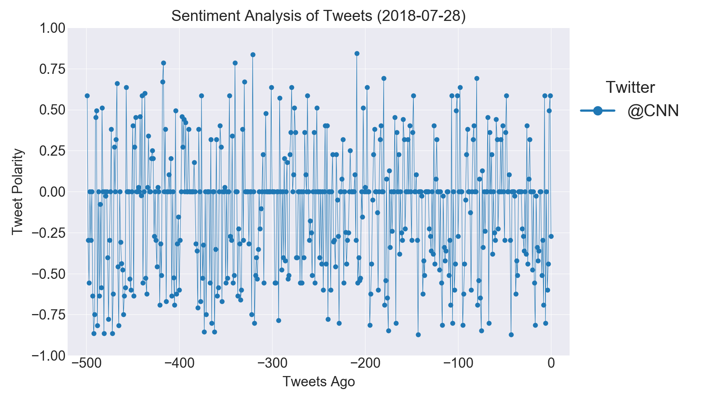
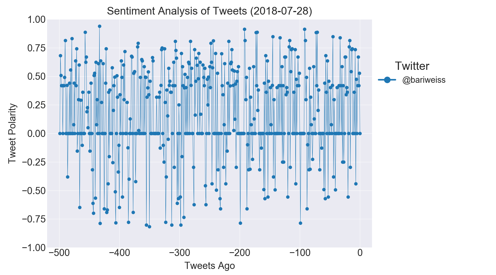
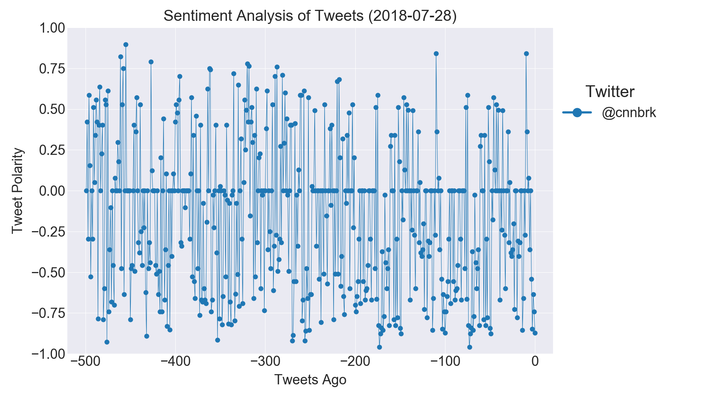

# Twitter Plot Bot
A plot bot written as part of the USC Data Analytics Bootcamp.

We employ the [@BotUSCDataAna](https://twitter.com/BotUSCDataAna) Twitter account.

As described in the [Instructions](Instructions/README.md), we have implemented a small twitter bot that will carry out a simple VADER-based sentiment analysis of the last 500 tweets of a specified Twitter account. The syntax to invoke the bot is as follows:

```@BotUSCDataAna Analyze: @CNN```

In this case, a sentiment analysis is carried out for <code>@CNN</code> and the compound result (tweet polarity) is plotted. 1 is completely positive, -1 is completely negative, and 0 is neutral:



Note that the bot always replies to the requesting user using <code>in\_reply\_to\_status\_id</code>. So its tweets show up only in its "Tweets & Replies" section and not on its home timeline.

Note: I deviated from the instructions in the following way: The instructions said to ignore requests for analysis of Twitter users who've already been analyzed. I found this to be a too strict restriction. Instead, requests for the same analysis will only be ignored if they come from the same requester. Two different Twitter users can still request the same analysis and will be served by the bot!

Here are some additional analyses:




